<!-- ======================= ANIMATED WAVING HEADER ======================= -->
<!-- Swap the gradient by editing color=0:1a1b27,100:4977c9 (start,end hex, no #) -->

<!-- ======================= TYPING INTRO ======================= -->
<h1 align="center">
  
</h1>

<!-- ======================= SOCIAL BADGES ======================= -->
<!-- TODO: replace the # links below with your real profile URLs -->

<!-- ======================= ABOUT ME ======================= -->
 

  Hi, I'm Alexander Li, an aspiring software engineer from Ontario
   
   
  🏆 <b>Hackathon Achievements:</b>
   
  <b>1st Place Overall</b> - Formula Null (UW ’25) 🏎️
   
  <b>1st Place Overall</b> - DeltaHacks X (McMaster ’24)
   
  <b>1st Place Overall</b> - RythmHacks (UW ’23)
   
  <b>1st Place Overall</b> - Mayfield Hacks (’23)
   
  <b>2nd Place Overall</b> - Ignition Hacks v.4 (’24)
   
  <b>3rd Place Overall</b> - WolfHacks (’24)
   
  <b>Best AR/VR</b> - Incubator Hacks (’24)
   
  <b>Best Use of AI/ML</b> - Hack The Valley 9 (’24)
   
  <b>Best Game Mechanic</b> - AngelHacks 3.0 (’23)
   
  <i>Participated in 20+ Hackathons total</i>
   
   
  🏫 I'm currently studying Computer Science + Finance at the University of Waterloo
   
  💻 I love playing Chess in my free time and learning new things
   
  👨‍💻 I’m currently working on some super cool side projects!
   
  💬 Ask me anything by opening an issue <a href="https://github.com/SpiritByte/SpiritByte/issues" title="Issue">here</a>
   
  📫 How to reach me: <a href="mailto:alexanderli@hotmail.ca">alexanderli@hotmail.ca</a>

 

<!-- divider -->

<!-- ======================= GITHUB STATS ======================= -->
<h2 align="center">「 📈 」 GitHub Stats</h2>

  
  

  

<!-- Activity line graph (last 31 days) -->

<!-- divider -->

<!-- ======================= CONTRIBUTION SNAKE ======================= -->
<!-- Auto-generated by the "Generate Snake Animation" workflow, served from the output branch -->
<h2 align="center">「 🐍 」 Watch the Snake Eat My Contributions</h2>

  <picture>
    <source media="(prefers-color-scheme: dark)" srcset="https://raw.githubusercontent.com/SpiritByte/SpiritByte/output/github-contribution-grid-snake-dark.svg"/>
    <source media="(prefers-color-scheme: light)" srcset="https://raw.githubusercontent.com/SpiritByte/SpiritByte/output/github-contribution-grid-snake.svg"/>
    
  </picture>

<!-- divider -->

<!-- ======================= DETAILED METRICS ======================= -->
<!-- Auto-generated by the "Generate Metrics" workflow, committed to the repo root as metrics.svg -->
<h2 align="center">「 📊 」 Detailed Metrics</h2>

  

<!-- divider -->

<!-- ======================= SKILLS ======================= -->
<h2 align="center">「 💼 」 Skills</h2>
 

More Skills

 

 

 

<!-- divider -->

<!-- ======================= PINNED REPOSITORIES ======================= -->
<h2 align="center">「 📌 」 Pinned Repositories</h2>

  
  
   
  
  

<!-- divider -->

<!-- ======================= TROPHIES ======================= -->
<h2 align="center">「 🏆 」 GitHub Trophies</h2>

<!-- ======================= QUOTE ======================= -->
<h2 align="center">「 📣 」 Quote Of The Century</h2>

  
“There is nothing in a caterpillar that tells you it's going to be a butterfly.” ― R. Buckminster Fuller.

 

[Check out my latest projects!](http://alexanderli.rf.gd)

<!-- ======================= VISITOR BADGE ======================= -->
 

  

<!-- ======================= ANIMATED WAVING FOOTER ======================= -->
